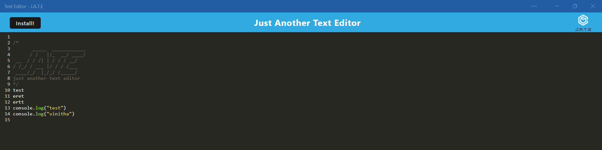
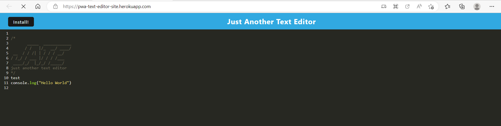

# PWA_Text_Editor
## Table of Contents

- [Description](#description)
- [User Story](#user-story)
- [Acceptance Criteria](#acceptance-criteria)
- [Installation](#installation)
- [Usage](#usage)
- [Image](#image)
- [Repository](#repository)
- [Production](#production)
- [Contributing](#contributing)
- [Questions](#questions)

## Description

Its a text editor that runs in the browser which allow to save text(which highlights the Javascript syntax) in IndexedDB database.This app is progressive web app which will work perfectly in offline.

## User Story
```md
AS A developer
I WANT to create notes or code snippets with or without an internet connection
SO THAT I can reliably retrieve them for later use
```

## Acceptance Criteria
```md
GIVEN a text editor web application
WHEN I open my application in my editor
THEN I should see a client server folder structure
WHEN I run `npm run start` from the root directory
THEN I find that my application should start up the backend and serve the client
WHEN I run the text editor application from my terminal
THEN I find that my JavaScript files have been bundled using webpack
WHEN I run my webpack plugins
THEN I find that I have a generated HTML file, service worker, and a manifest file
WHEN I use next-gen JavaScript in my application
THEN I find that the text editor still functions in the browser without errors
WHEN I open the text editor
THEN I find that IndexedDB has immediately created a database storage
WHEN I enter content and subsequently click off of the DOM window
THEN I find that the content in the text editor has been saved with IndexedDB
WHEN I reopen the text editor after closing it
THEN I find that the content in the text editor has been retrieved from our IndexedDB
WHEN I click on the Install button
THEN I download my web application as an icon on my desktop
WHEN I load my web application
THEN I should have a registered service worker using workbox
WHEN I register a service worker
THEN I should have my static assets pre cached upon loading along with subsequent pages and static assets
WHEN I deploy to Heroku
THEN I should have proper build scripts for a webpack application
```

## Installation

`npm init`

`npm i`
`npm run install`


## Usage

Run the following command at th root of your project and check the app

`npm run build`
`npm run start:dev`

## Contributing

[Vinitha Gowtheepan](https://github.com/sreevinithaa)

## Image





## Repository

You can get the code in the following link. https://github.com/sreevinithaa/PWA_Text_Editor.git

## Production

You can check the app in following link. https://pwa-text-editor-site.herokuapp.com/


## Questions

Contact me with any questions: [email](mailto:sreevinithaa@gmail.com) , [GitHub](https://github.com/sreevinithaa)<br />


